Adding assets, areas and potentials
===================================

Energy assets are the core components of an ESDL energy system description. Energy assets can be subdivided into 5 different
types, the so called ESDL capabilities.

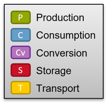

The following table shows some examples of each capability with its MapEditor icon:

+------------------+----------------------------------------------+------------------------------------------+
+ ESDL asset types + Example icons                                + ESDL asset examples                      +
+------------------+----------------------------------------------+------------------------------------------+
| Producer         | |WindTurbine| |GeothermalSource| |Import|    | WindTurbine, GeothermalSource, Import    |
+------------------+----------------------------------------------+------------------------------------------+
| Consumer         | |HeatingDemand| |Export| |ElectricityDemand| | HeatingDemand, Export, ElectricityDemand |
+------------------+----------------------------------------------+------------------------------------------+
| Conversion       | |PowerPlant| |HeatPump| |GasHeater|          | PowerPlant, HeatPump, GasHeater          |
+------------------+----------------------------------------------+------------------------------------------+
| Storage          | |Battery| |ATES| |WaterBuffer|               | Battery, ATES, WaterBuffer               |
+------------------+----------------------------------------------+------------------------------------------+
| Transport        | |ElectricityCable| |Transformer| |Pipe|      | ElectricityCable, Transformer, Pipe      |
+------------------+----------------------------------------------+------------------------------------------+

Areas and potentials can only be added using the asset draw select tool, but there are multiple ways to add assets to
the map:

* Via the asset draw select tool (nr 3. in :ref:`this picture<The ESDL MapEditor user interface>`)
* Via the asset draw toolbar (nr. 15 in :ref:`this picture<The ESDL MapEditor user interface>`)
* Using templated assets from the Energy Data Repository

Adding assets, areas or potentials via the asset draw select tool
-----------------------------------------------------------------
Adding assets, areas or potentials is done via the asset draw select tool located in the middle of the top menu bar.
Actually it is split into two separate select tools to speed up drawing pipes and cables.

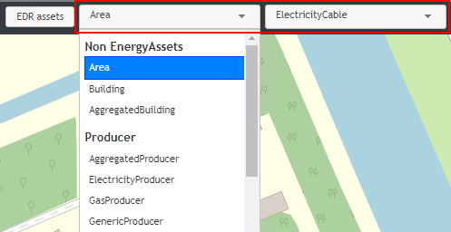

The left select tool (nr. 3 in :ref:`this picture<The ESDL MapEditor user interface>`) contains 7 groups:

* a group for 'Non EnergyAssets', with Area, Building and AggregatedBuilding
* 5 groups for Producer, Consumer, Storage, Transport and Conversion assets
* a group with all 'Potentials'

By selecting one of the options out of this list, the user starts drawing this on the map immediately.

Another relevant UI part are the draw controls (nr. 12 in :ref:`this picture<The ESDL MapEditor user interface>`):

.. image:: images/draw_controls.png
   :width: 60
   :alt: Draw controls

From top to bottom they represent drawing a line, drawing a polygon, drawing a square and drawing a point (or marker).

Each asset (and area and potentials too) has a default 'shape' on the map. At the moment these defaults are:

* Polygon: Area, PVPark, WindPark
* Line: Pipe, ElectricityCable
* Point: everything else

You can switch the shape using the draw controls on the left, before clicking on the map. So for example, if you select
a Transformer asset from the list, by default the 'marker draw tool' is selected. If you first click on the 'polygon
draw tool' and then start drawing on the map, a Transformer asset can get a polygon geometry where the space taken on
the map by this transformer is represented in the ESDL data.

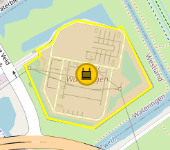

Drawing pipes and cables
------------------------
Pipes and cables can be drawn using the method above (by selecting Pipe of ElectricityCable in the long list of the
left select tool). To speed up drawing pipes and cables, we've added a second select tool specifically for pipes and
cables. If the user selects the 'line draw tool' from the draw controls on the left, the right part of the select tool
(nr. 4 in :ref:`this picture<The ESDL MapEditor user interface>`) determines if a pipe or a cable is drawn.

.. note::
    ElectricityCables and Pipes can also be added as icons (with a point location) instead of lines. This can be useful
    if your model requires to add properties of a cable or pipe (like capacity or diameter), but you don't know the
    exact trajectory of the cable or pipe.

Adding assets via the asset draw toolbar
----------------------------------------
Adding assets using the Asset draw toolbar is the most convenient way of doing this. It is fully user configurable and
adding assets is just a matter of clicking once on the icon of the asset on the toolbar and then clicking on the map
(once or as many times as you like). The default shape can again be changed before the actual drawing is started.

In :ref:`this section<Asset Draw Toolbar>` the configuration options of the asset draw toolbar are described in more detail.

Adding assets using the Energy Data Repository
----------------------------------------------
Adding templated assets from the Energy Data Repository (EDR), can be done by clicking on the 'EDR assets' button at
the top (nr. 2 in :ref:`this picture<The ESDL MapEditor user interface>`). It's described in more detail
:ref:`here<Adding assets from the Energy Data Repository>`

.. |ATES| image:: images/ATES.png
   :width: 30pt

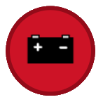

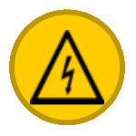

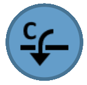

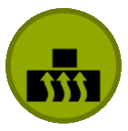

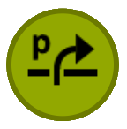

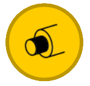

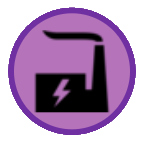

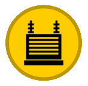

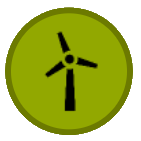
