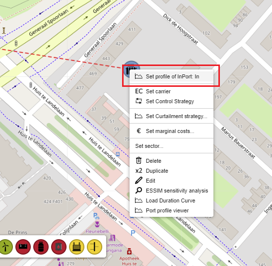
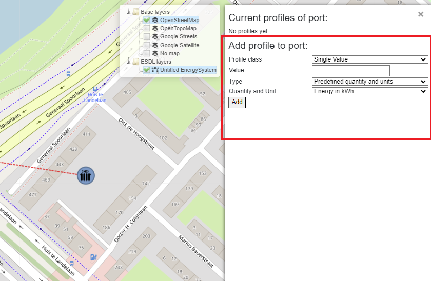
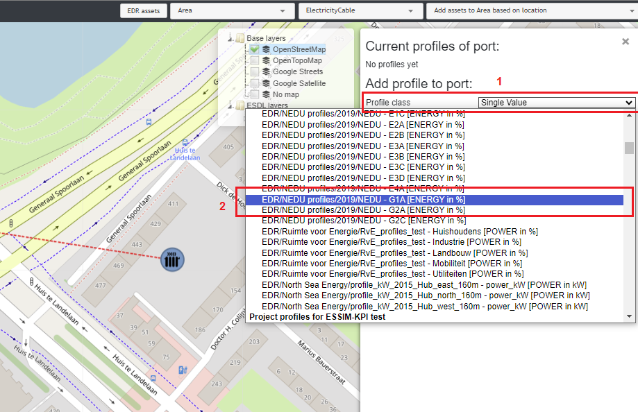
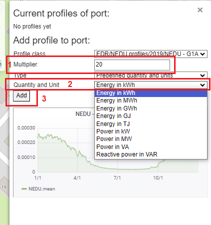

Assigning profiles
==================

Profiles in ESDL are attached to assets' InPorts and OutPorts. MapEditor offers a list of pre-defined profiles, such as standard NEDU profiles, that a user can choose from.

To attach a heat demand profile to a HeatingDemand, right-click on the asset and choose "Set profile of InPort".

A pop-up menu appears with different parameters for a profile. The parameters that need to be set for a profile include:

* Profile class
* Value
* Type
* Quantity and Unit

These parameters can be selected and entered in the fields below.

In this example, the yearly heating demand will be set to 20 kWh. The *Profile class* dropdown menu offers a number of different types of profiles, some pre-loaded in MapEditor, others from EDR (Energy Data Repository), but also custom profiles.
To choose a heating demand profile of a typical Dutch neighborhood, select *NEDU G1A* profile class from the Profile class dropdown menu.

To set the value of 20 kWh demand per year, enter 20 in the *Multiplier* field (nr.1), and choose *Energy in kWh* from the *Quantity and Unit* dropdown menu (nr.2). To save the changes, click the *Add* button (nr.3).

