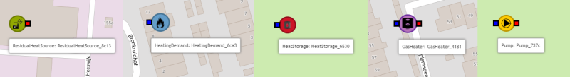

Connecting assets
=================

ESDL knows the concept of ports and connections to connect assets. Ports exist in two types (by design, see
`this article <https://energytransition.gitbook.io/esdl/esdl-concepts/energy-system-structure>`_ for more detailed
information):

* InPort: port that is mainly used for incoming flow, current or energy
* OutPort: port that is mainly used for outgoing flow, current or energy

An InPort is visualized as a gray square to the left on an asset, an OutPort is visualized as a black square to the
right of an assets. InPorts can only be connected to OutPorts and the other way around.

The amount and type of ports the MapEditor attaches to an asset when the user adds an asset to the map, depends on the
view mode. The standard behaviour is as follows (for drawing 'single-line systems'):

* Producer: 1 OutPort
* Consumer: 1 InPort
* Storage: 1 InPort
* Conversion: 1 InPort and 1 OutPort

  * There are two exceptions to this rule, for the CoGeneration types (CHP and FuelCell): They'll get 1 InPort and 2 OutPorts

* Transport: 1 InPort and 1 OutPort

If you switch the view mode to 'CHESS', this behaviour changes to (for drawing 'double-line systems'):

* Producer: 1 InPort and 1 OutPort
* Consumer: 1 InPort and 1 OutPort
* Storage: 1 InPort and 1 OutPort
* Conversion: 1 InPort and 1 OutPort
* Transport: 1 InPort and 1 OutPort

  * There are two exceptions to this rule, for the Transformer and HeatExchange: They'll get 1 InPort and 1 OutPort
    for the primary side and 1 InPort and 1 OutPort for the secondary side
  * You can manually add more ports if required.

Connecting assets by using the ports
------------------------------------

There are two ways to connect assets:

1. You can connect the assets directly by connecting a port from one asset to the port of
   another asset. Make sure the ports are different: an InPort can only be connected to an OutPort and vice versa.

   .. image:: images/mapeditor_basictask_connect_ports.png
     :alt: Connecting two asset by clicking on the ports.

   You can connect one InPort to multiple OutPorts and vice versa.

  * To connect assets in the MapEditor, click with the mouse on a port and a dotted line appears that can be directly
    connected to another port (of a different type). To connect click on that port and the connection is made.
  * When two ports are connected a dotted line between the assets is shown. The color of that dotted line is an
    visualisation of the carrier of the Ports and can be configured via the View menu -> Carriers.
  * Ports without carriers have a dark gray color.

2. You connect them by using a so called Conductor. Currently there are two types of Conductors: a Pipe and an ElectricityCable.

   To ease the creation of networks of pipes or cables, there is a shortcut in the MapEditor to directly connect conductors to
   assets (e.g. it makes the connection between the asset and the pipe/cable automatically).

   To do that, use the line tool on the right side of the screen to
   start drawing a pipe or a cable. Which one is drawn is shown at the top of the page and can be changed during drawing.

   * To directly connect a conductor to an asset click on the port you want to connect and draw the pipe. *Make sure you
     selected the line tool in the draw toolbar on the left.* You can add bends while drawing the Conductor by clicking on
     the map.

     * To connect directly to another asset, click the corresponding port of that asset. The MapEditor filters out only ports
       of the correct type, e.g. when start drawing on an InPort (gray square), only OutPorts (black squares) are shown.
     * To end the pipe/cable somewhere else on the map, click the last point of the line again to end drawing.

    .. image:: images/mapeditor_basictask_connect_assets.png
      :alt: Connecting two asset by using the Line tool

  If you quickly want to connect two assets, you can also the Ctrl key: do Control+Click on a port. It will then start
  to draw a port/cable directly, without selecting the line draw button from the toolbar first.

Keyboard shortcuts
------------------
There are a few keyboard shortcuts to speed up drawing cables and pipes:

* Press the Ctrl-key before clicking a port (Ctrl + click), will directly turn on pipe/cable drawing.
* Press 'c' to draw a cable,
* Press 'p' to draw a pipe,
* Press 'a' to draw the last selected asset in the menu bar directly.

Make sure the map has focus to capture these shortcut keys, e.g. by clicking on the map itself first if that is not the case.

