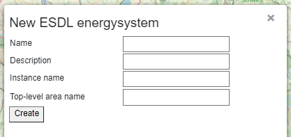
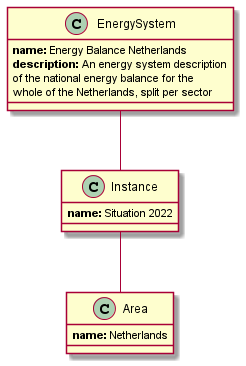

Creating an energy system description
=====================================

When you log into the ESDL MapEditor for the first time, you start with an empty energy system description. You can
then start drawing your energy system. At any moment in time you can choose 'New ESDL' from the 'File' menu to start
with an empty energy system again.

You are asked to fill in the following information:

* Energy system name
* Energy system description
* Energy system instance name
* Top-level area name

After filling in those fields, an example structure like shown below will be created in memory. ESDL energy assets
(or other sub areas) can then be added to the top-level area to model a certain use case.

