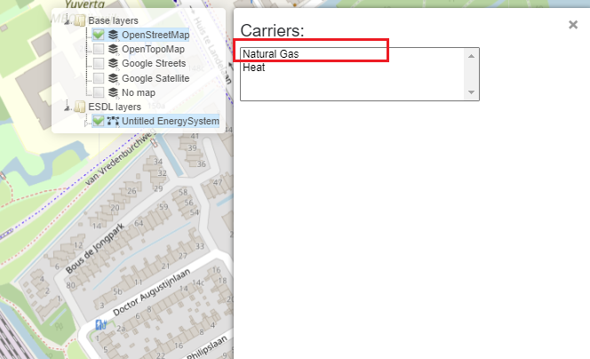

Defining and setting energy carriers
====================================

ESDL energy assets produce, consume, store, or convert different energy commodities and carries such as, for example, gas (natural gas, hydrogen etc.), electricity, or heat. These commodities and carriers are assigned to connections between energy assets.

In this basic scenario, two Commodities exist: gas (imported from an external system) and heat (as a result of GasHeater conversion). To add an energy Commodity, mouseover the Edit menu item and click on *Energy carriers...* (see figure below). A pop-up menu opens with a list of energy Carriers and Commodities that can be added and configured.

Click on the *Carrier type* dropdown menu (nr.1), and select *Gas Commodity* (nr.2).

Give it a descriptive name (e.g. Natural Gas) (nr.1) and leave the other fields blank. To save the changes, click on *Add* (nr.2).

The created Gas Commodity (Natural Gas) is shown on the pop-up window, along with the color that will be used to visualize the connections that have this commodity. The color of the commodity can be changed.

Repeat the same process to create Heat commodity.

Assigning energy commodities to asset connections
-------------------------------------------------

Energy carriers and commodities created in the previous steps are assigned to connections between ESDL energy assets, i.e. to their In and Out ports. To assign the natural gas commodity to Import asset, right-click on Import and select *Set carrier*.

.. image:: images/adding_commodities5.png
   :width: 300
   :alt:

A pop-up window opens with a list of created energy commodities (Natural Gas and Electricity, in this example). To assign Natural gas to Import asset, click on Natural Gas in the list of carriers. The window automatically closes, and Natural Gas is assigned to the OutPort of Import, and the InPort of GasHEater, as there already exists a connection between these two ports.

The connection between the Import and GasHeater is colored red (the color assigned to Natural Gas commodity), indicating the assigned commodity.

