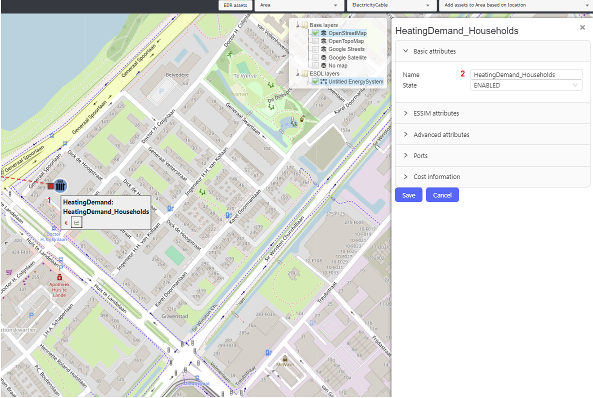
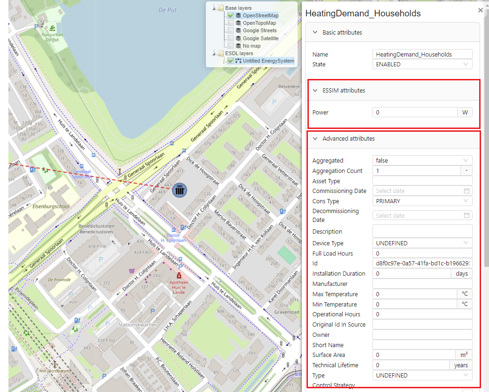
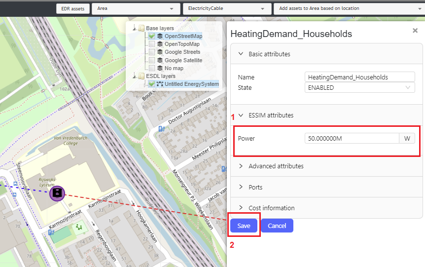
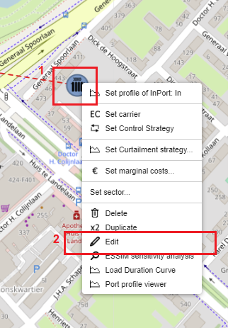
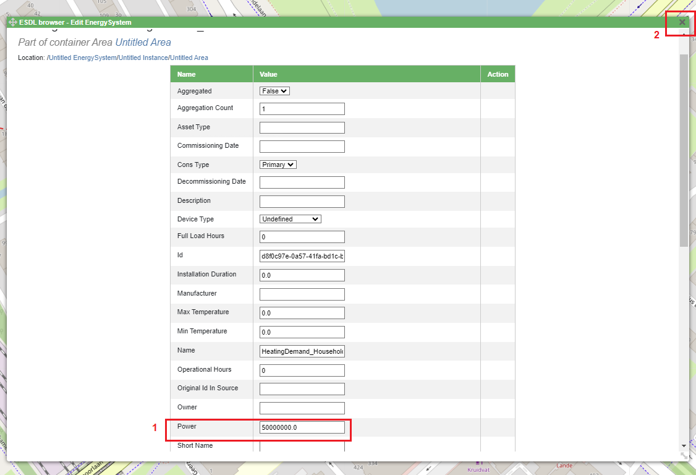

Editing asset properties
========================

A created ESDL asset has a number of attributes (properties) that can be changed by a MapEditor user. The easiest way to change attributes of an ESDL asset is to click on the created asset. For example, to edit a HeatingDemand, (left)click on the HeatingDemand icon (nr. 1).
This action opens a side menu with all asset parameters that can be changed (nr.2). The side menu contains different attribute categories, namely:

* Basic attributes
* ESSIM attributes
* Advanced attributes
* Ports
* Cost information

Each of these categories contains different assets that can be relevant for different simulation tools.

To edit attributes relevant for an ESSIM simulation, click on the ESSIM attributes category. This action opens a list of attributes relevant for ESSIM simulation tool.
The same principle applied to other categories as well.

To change the HeatingDemand's power and set it to 50MW, enter 50M (power is always specified in Watts) in the power field (nr.1). To save the changes, click on the Save button (nr.2).

Editing asset properties using ESDL browser
-------------------------------------------

The parameters of an ESDL asset can also be changed through the ESDL browser. This provides more details and ability to navigate through each (connecting) element individually. To change the power parameter through the ESDL browser, right-click on the HeatingDemand (nr.1) and select Edit (nr.2).

To change the HeatingDemand's power attribute, enter a new value for power (nr.1) and close the window (nr.2). The changes are saved automatically.

