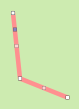

Moving assets and changing asset shapes
=======================================
Handling assets depends on its shape on the map. Assets represented as a marker, line or polygon
can be moved or changed shape using the edit and remove controls at the left side of the map
(nr. 13 in :ref:`this picture<The ESDL MapEditor user interface>`):

By clicking on the upper icon, you start the edit mode. All assets can then be moved. The edit mode must be
confirmed by pressing the 'save' button.

.. note::
   Assets represented as a marker, with a point location can be moved by just dragging the icon to another location.

Moving or changing a line
-------------------------
A line in edit mode, looks like this:

You know have three options:

* By dragging the single gray handle, the line can be moved as a whole
* By dragging the vertex handles, the line vertex can be moved
* By dragging the handle in the middle of an edge, an extra vertex will be created

Moving or changing a polygon
----------------------------
A polygon in edit mode, looks like this:

You know have three options:

* By dragging the single gray handle, the polygon can be moved as a whole
* By dragging the vertex handles, the polygon vertex can be moved
* By dragging the handle in the middle of an edge, an extra vertex will be created
