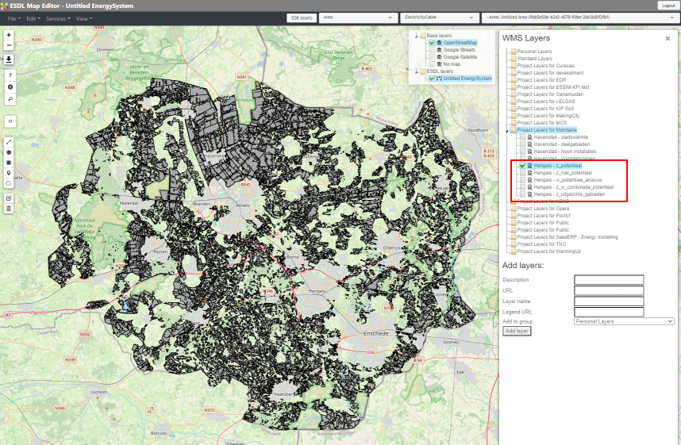

Importing search areas
======================

Maps with information about search areas where large scale onshore wind and solar parks development should be focussed,
are often used as an input for a certain energy system scenario. If this information is already hosted in for example
an ARCGIS server environment, these layers are often offered as a WMS service.

If you have one or more files on your filesystem, you need to host these files one way or the other. GIS files of many
different types can be hosted in a separate Geoserver instance. Examples are shapefiles, geojson files
and geopackage files. The MapEditor has no interface for uploading these file types, so you have to use the management
interface of your Geoserver instance.

With the hosted versions of the maps, you can follow the section about :ref:`WMS layer data` to visualize the information
on the map.

