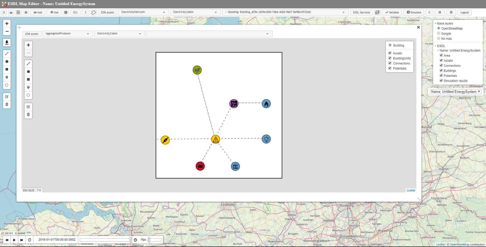

Building editor
===============

.. code-block:: XML

      <asset xsi:type="esdl:Building" name="Building_d29e" id="d29ec68d-7dbe-4d26-96b7-8af8bc5f32dd">
        <geometry xsi:type="esdl:Point" lon="4.872436523437501" CRS="WGS84" lat="52.16344158093824"/>
        <asset xsi:type="esdl:EConnection" name="EConnection_d45f" id="d45f1a3d-3690-4f1d-bfcb-3ed054dad01a">
          <port xsi:type="esdl:InPort" name="In" id="60dfbdca-9a2a-4e9b-b3ce-250f4aa67a3e" connectedTo="fb5a600a-ce2e-4c9f-a1af-2836681284c9"/>
          <port xsi:type="esdl:OutPort" name="Out" connectedTo="7d77c5a5-d041-46d8-9320-729c467072f2" id="fb70093f-980c-4766-b605-aa0fb74374e6"/>
          <geometry xsi:type="esdl:Point" lon="35.0" lat="155.0"/>
        </asset>
        <asset xsi:type="esdl:ElectricityDemand" name="ElectricityDemand_5b4e" id="5b4eb987-9c9f-4c05-8cb3-63a29983ce11">
          <port xsi:type="esdl:InPort" name="In" id="ebf8dbf9-8de4-4964-b7d2-8ff8b9f308b8" connectedTo="ca8cfdf4-0e25-4059-9376-eb3909bf9b20"/>
          <geometry xsi:type="esdl:Point" lon="434.0" lat="159.0"/>
        </asset>
        <asset xsi:type="esdl:HeatingDemand" name="HeatingDemand_5c20" id="5c20f004-3421-448e-9931-bdd109f38d5e">
          <port xsi:type="esdl:InPort" name="In" id="90aeec70-5fb5-4567-a580-4bbbb2d2a1b6" connectedTo="e912e03e-1144-4688-8814-69c478bb9338"/>
          <geometry xsi:type="esdl:Point" lon="434.0" lat="299.0"/>
        </asset>
        <asset xsi:type="esdl:PVInstallation" name="PVInstallation_c712" id="c7120d65-7263-4b85-82a1-19c965b0cb68">
          <port xsi:type="esdl:OutPort" name="Out" connectedTo="7d77c5a5-d041-46d8-9320-729c467072f2" id="e7f5e784-7aa7-4f98-abc5-160dbcee83c5"/>
          <geometry xsi:type="esdl:Point" lon="161.0" CRS="Simple" lat="431.5625"/>
        </asset>
        <asset xsi:type="esdl:ElectricityNetwork" name="ElectricityNetwork_18ad" id="18add2fa-cf90-437d-8d8a-8068a45032c1">
          <port xsi:type="esdl:InPort" name="In" id="7d77c5a5-d041-46d8-9320-729c467072f2" connectedTo="fb70093f-980c-4766-b605-aa0fb74374e6 e7f5e784-7aa7-4f98-abc5-160dbcee83c5"/>
          <port xsi:type="esdl:OutPort" name="Out" connectedTo="b94d2cd5-eecd-40ba-991e-3e678d15b3f7 ebf8dbf9-8de4-4964-b7d2-8ff8b9f308b8 46264890-dc59-4526-8d28-a89b32406213 6b63c1be-3a85-448e-ad04-5094ff732463" id="ca8cfdf4-0e25-4059-9376-eb3909bf9b20"/>
          <geometry xsi:type="esdl:Point" lon="234.0" CRS="Simple" lat="157.5625"/>
        </asset>
        <asset xsi:type="esdl:Battery" name="Battery_1dc0" id="1dc097c5-ee72-40f1-84a3-8a37e93b5464">
          <port xsi:type="esdl:InPort" name="In" id="6b63c1be-3a85-448e-ad04-5094ff732463" connectedTo="ca8cfdf4-0e25-4059-9376-eb3909bf9b20"/>
          <geometry xsi:type="esdl:Point" lon="173.0" CRS="Simple" lat="51.5625"/>
        </asset>
        <asset xsi:type="esdl:EVChargingStation" name="EVChargingStation_d1cc" id="d1cc33a5-a82e-4c68-a8aa-0751cb1f3c68">
          <port xsi:type="esdl:InPort" name="In" id="46264890-dc59-4526-8d28-a89b32406213" connectedTo="ca8cfdf4-0e25-4059-9376-eb3909bf9b20"/>
          <geometry xsi:type="esdl:Point" lon="312.0" CRS="Simple" lat="50.5625"/>
        </asset>
        <asset xsi:type="esdl:HeatPump" name="HeatPump_9bbf" id="9bbfac6f-890d-443f-b14e-95e263735717">
          <port xsi:type="esdl:InPort" name="In" id="b94d2cd5-eecd-40ba-991e-3e678d15b3f7" connectedTo="ca8cfdf4-0e25-4059-9376-eb3909bf9b20"/>
          <port xsi:type="esdl:OutPort" name="Out" connectedTo="90aeec70-5fb5-4567-a580-4bbbb2d2a1b6" id="e912e03e-1144-4688-8814-69c478bb9338"/>
          <geometry xsi:type="esdl:Point" lon="306.0" CRS="Simple" lat="298.5625"/>
        </asset>
      </asset>