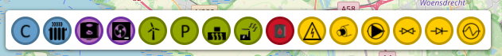
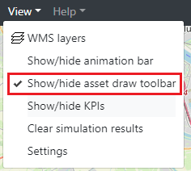
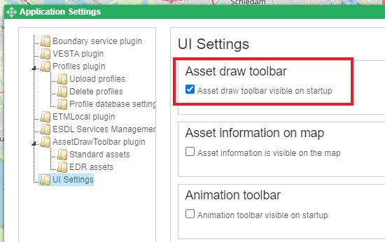
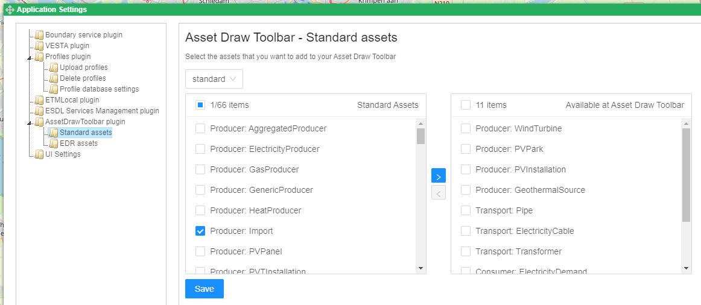

Asset Draw Toolbar
==================

The asset draw toolbar is a toolbar that eases the selection of frequently used assets. Users can configure the asset
draw toolbar according to their needs.

Show and hide the Asset Draw Toolbar
************************************

In the 'view' menu you can choose to show or hide the Asset Draw Toolbar

Settings at startup
*******************

In the application settings window, in the section 'UI Settings' you can select what the initial status of
visibility of the Asset Draw Toolbar is when you log in into the ESDL MapEditor. You can show the application settings
window by selecting 'settings' in the 'view' menu.

Configuring the Asset Draw Toolbar
**********************************

In the application settings window, in the section 'AssetDrawToolbar plugin', subsection 'Standard assets' you can
determine which assets you want to appear in the toolbar. These settings depend on the view mode. The view mode can be
selected with the select box at the top of the configuration window. This allows you to have different assets visible
in the toolbar when you're drawing a detailed design of a district heat network, than when you're designing a more high
level energy system. In the below picture the view mode 'standard' has been selected. You can move assets from left to
right to let them appear in the toolbar and from right to left to let them disasppear.

In the subsection 'EDR assets' the same can be done for assets from the EDR that are frequently used.
