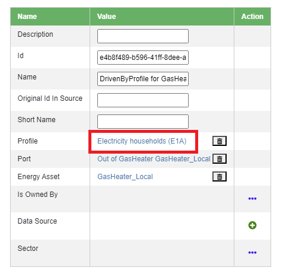

Assigning control strategies
============================

Models of (hybrid) energy systems created in MapEditor can be simulated by simulation tools that *speak* ESDL. Different tools simulate energy assets' behaviour (e.g. when and how it consumes of produces energy) in different ways. One way to define such behavior is using *control strategies*. Control strategies are assigned to assets' ports, and are directly related to the type of a port, as well as the type of an asset.

One of the simulation tools that uses ESDL to calculate energy balance in a system is *ESSIM* (Energy System Simulator). Below is the list of control strategies used by ESSIM to perform its analysis, describing what each strategy is and how to assign it to an asset.

DrivenByDemand
______________

This control strategy is assigned to producers and to the production side of a conversion. An asset that is assigned this control strategy will produce energy only when there is demand from the assets connected to it. In other words, it will follow the demand of the asset(s) it is connected to.

To assign this control strategy, right-click on an asset and choose *Set Control Strategy*.

From the drop-down menu, choose *Driven by demand on OutPort*. This strategy can only be assigned to an OutPort, as it produces when there is demand.

Select the OutPort that has to follow the demand (nr.1). In this case, the asset has only one OutPort. Click on *Save* to set the control strategy (nr.2).

DrivenBySupply
______________

This control strategy is assigned to consumers and to the consumption side of conversions. An asset that is assigned this strategy will consume energy only when it is produced by the producer(s) connected to the asset.

To assign this strategy, follow the same steps as above. From the drop-down menu, choose *Driven by supply on InPort*. This strategy can only be assigned to an InPort, as it consumes when there is production.

DrivenByProfile
_______________

This control strategy is assigned to assets that have to follow a certain profile. Depending on the port it is assigned to, an asset will produce of consume as much energy as is needed according to the assigned profile.

To assign this strategy, follow the same steps as above. From the drop-down menu, choose *Driven by profile* (nr.1) and select the port to assign in to (nr.2). If profile from a database will be assigned, select *Profile from database* (nr.3), and select the profile from the dropdown menu (nr.4). If a custom profile will manually be added, select *Profile table editor*. Click on *Save* to assign the strategy (nr.5).
Note that for now, the control strategies window only allows the selection of the profile type, but the multiplier, quantity and unit have to be specified using the ESDL browser.

To specify these parameters, go to the ESDL browser of the GasHeater by right-clicking on the GasHeater and selecting *Edit*.

Scroll to *Control Strategy* and click on the name of the strategy, in this case *DrivenByProfile_for_GasHeater_Local*

Click on the profile name to edit its parameters.

Edit the desired parameters in the strategy window. For example, change the multiplier (nr.1) and create a quantity and unit for the profile (nr.2).

StorageStrategy
_______________

This control strategy is assigned to storage assets to simulate their charging and discharging behaviour.

To assign this strategy, follow the same steps as above. From the drop-down menu, choose *Storage strategy* (nr.1). Storage strategy requires setting marginal charge and discharge costs to direct an asset when to store and when to produce energy. The value of these costs should be between 0 and 1, and *Marginal charge costs* should always be lower than *Marginal discharge costs*. Set the costs in the provided fields, and click on *Save* (nr.2) to set the strategy.

If *Marginal charge costs* are set to a value higher than *Marginal discharge costs*, an error is shown, and the user is prevented from setting the strategy.

CurtailmentStrategy
___________________

This strategy is assigned to production assets and to the production side of a conversion to limit (curtail) its production. Even if an asset can (and should) produce energy, assigning this strategy will force it to produce less, as specified by the curtailment point in the strategy.

To assign this strategy, follow the same steps as above. From the drop-down menu, choose *Curtailment strategy* (nr.1), set the *Maximum power* in Watts (nr.2), and click on *Save* (nr.3).

