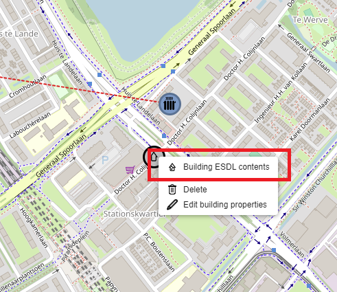
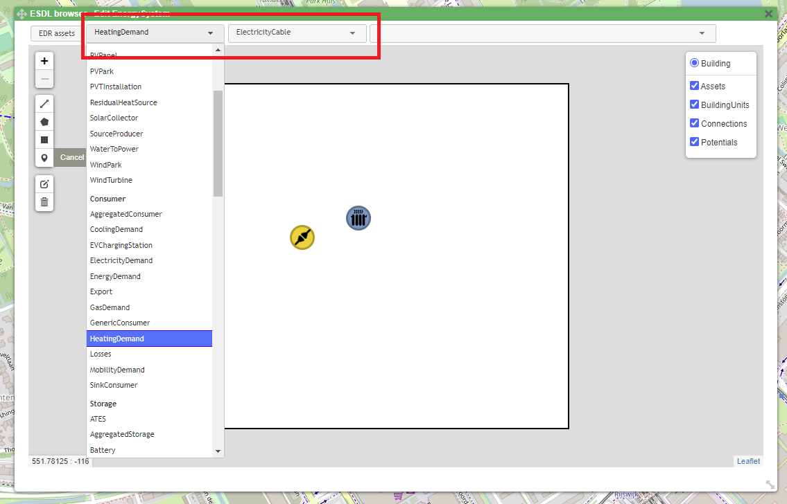
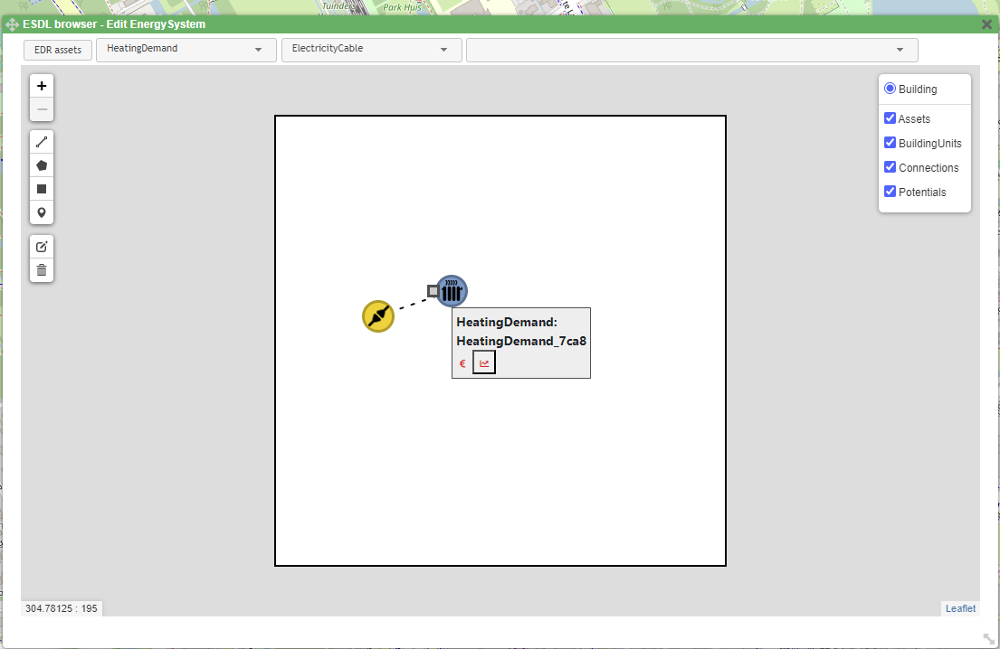
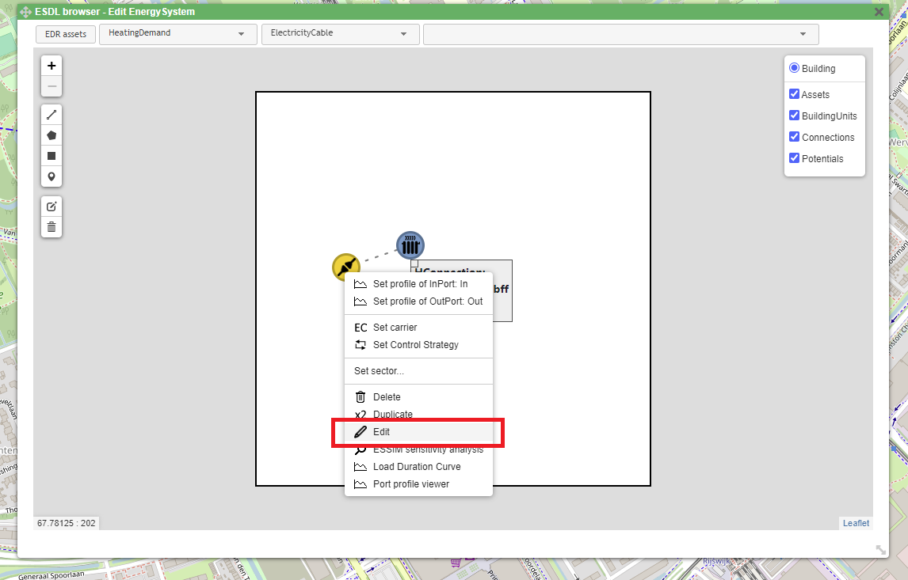
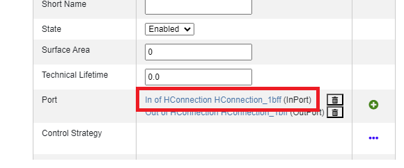
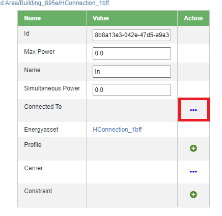
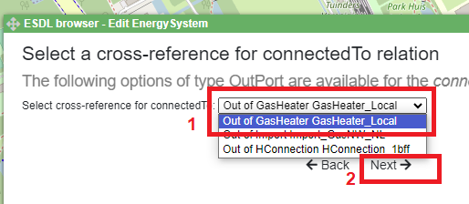
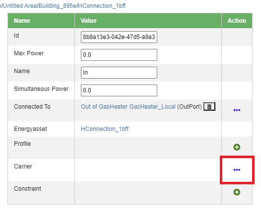
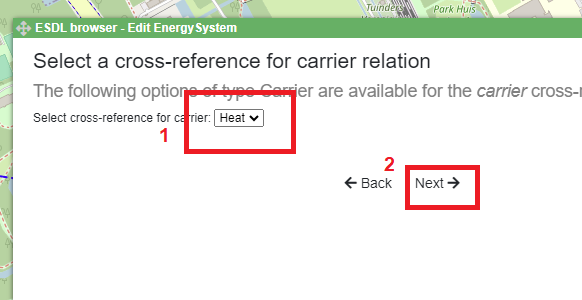

Building editor
===============

MapEditor allows modeling a building as a collection of different energy assets. This can be useful for different purposes, not only for a better visual representation, but also for analyzing the results of the simulations (depending on the simulator used).
An ESDL Building is not an energy asset, which is why energy assets should be added to it separately. To add energy assets to a created Building, right-click on the building and select *Building ESDL contents*.

A pop-up building menu opens with menus for creating, deleting and editing energy assets. Note that all the assets created for the Building have to be created using the Building menu. Create an HConnection (heat connection) and a HeatingDemand using the pop-up menu bar. The HConnection will be used to connect the Building to the heat production energy assets outside the building.

To connect the HeatingDemand to the HConnection, connect the two assets the same way assets outside the Building are connected.

Connecting an asset within the Building with the one outside the Building has to be done using the ESDL browser. To connect HConnection to the GasHeater outside the building, right-click on the HConnection and select *Edit*.

In the ESDL browser, navigate to *Port* and click on *In of HConnection*.

To select the port that HConnection's InPort should be connected to, navigate to *Connected To* and click on *...* next to it.

Select *Out of GasHeater* from the dropdown menu (nr.1), and click on *Next* (nr.2). The two assets are now connected.

To add the Carrier to the connection, navigate to *Carrier* of the port, and click on *...* next to it.

Select *Heat* from the dropdown menu (nr.1), and click on *Next* (nr.2). The Carrier is now assigned to the connection.

