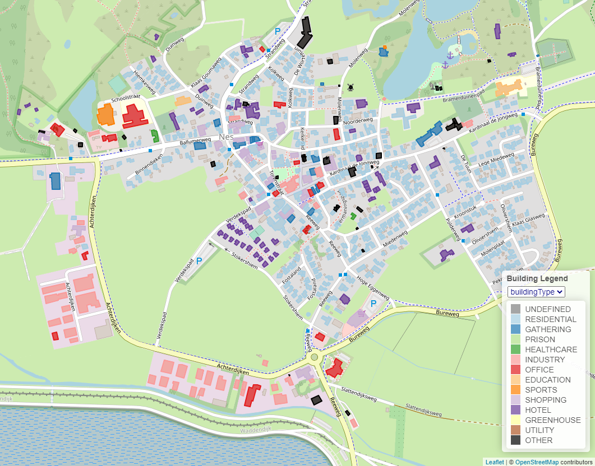

Building information
====================

Whenever you load an ESDL file, with buildings in it with their geometry (for example using the ESDL BAG service), the
MapEditor will visualize these buildings on the map. It will try to find three specific attributes of these buildings,
namely building year, building area and building type. The buildings will be colored according to these attributes. You
can choose the attribute that should be used for coloring in the dropdown menu at the top op the legend.

ESDL BAG service
^^^^^^^^^^^^^^^^
