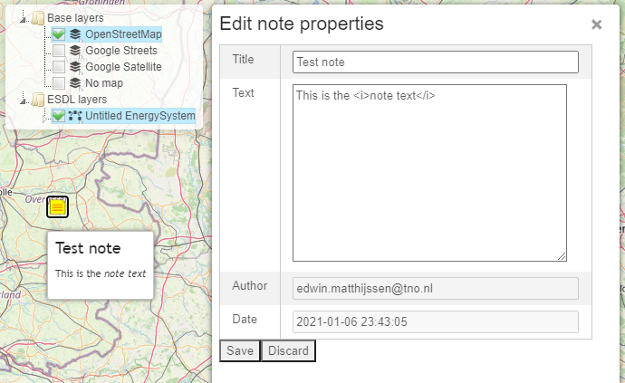

Notes
=====

You can add notes on the map to document certain design decisions. After you click the notes button, the next click on
the map adds a note at that position. When you click on the note itself, a sidebar opens as shown in the following picture.

Title and text can be edited. Author and date are automatically filled in based on the logged in user and the current
date and time.

Hovering over a note on the map, shows the title and the text.

Right click on a note, gives the possibility to delete a note again.
