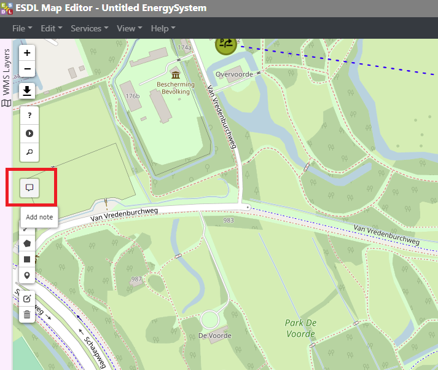
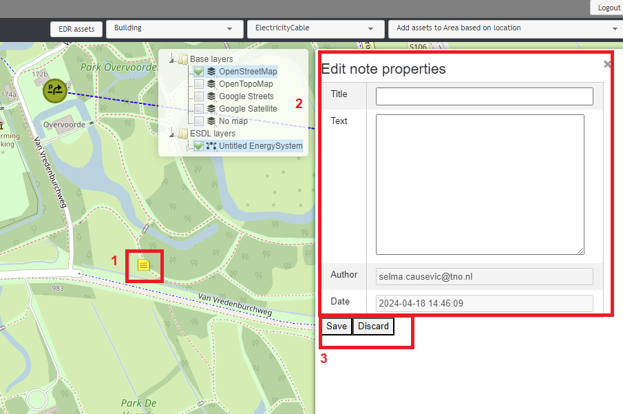
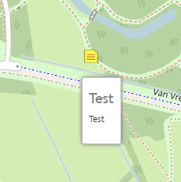

Notes
=====

To document certain design decisions (or any other remarks), users can add notes to their ESDL file. To create a note, click on the *Notes* icon on the sidebar.

After clicking the *Notes* button, add a note at a desired position on the map by clicking on that position. Clicking on a note itself (nr.1) opens a pop-up window to add a note title and text (nr.2).
Title and text of a note can be edited to give a description of, for example, a design decision. Author and date are automatically filled in based on the logged in user and the current
date and time. To save a note, click on the *Save* button. To discard the changes, click on the *Discard* button. (nr.3)

Hovering over a note on the map shows the title and the text of a note.

To delete a note from the ESDL, right-click on a note and select *Delete*.

