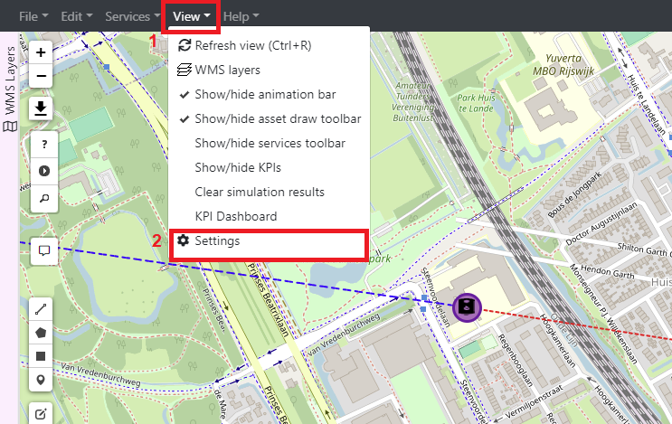
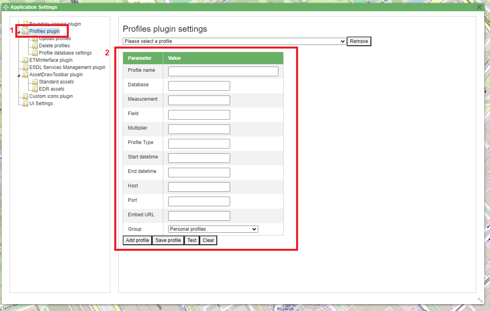
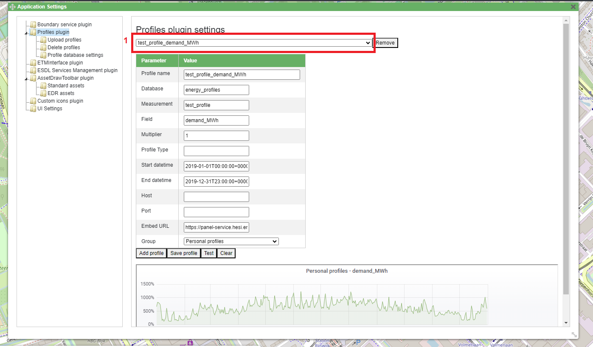
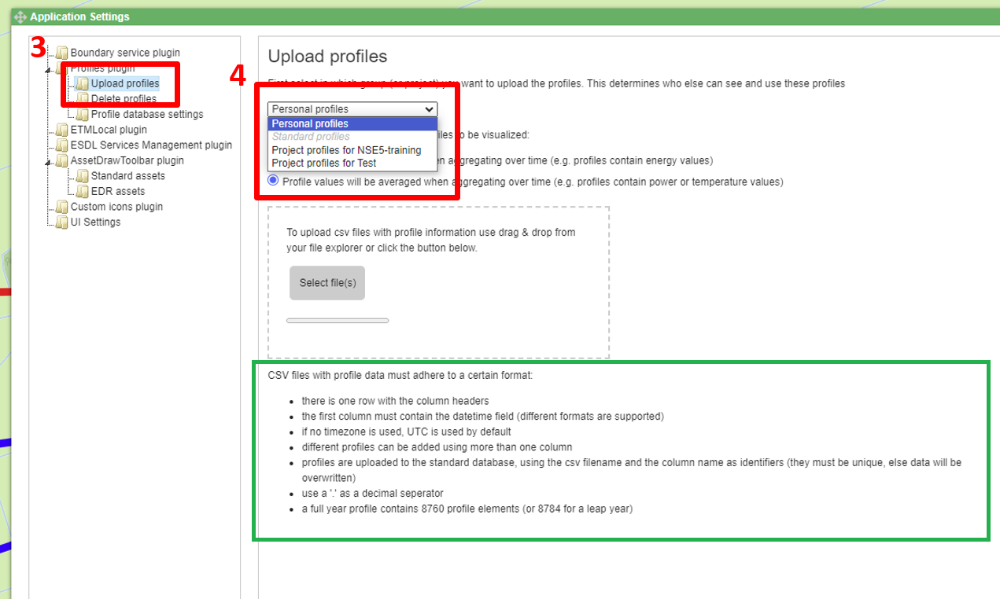
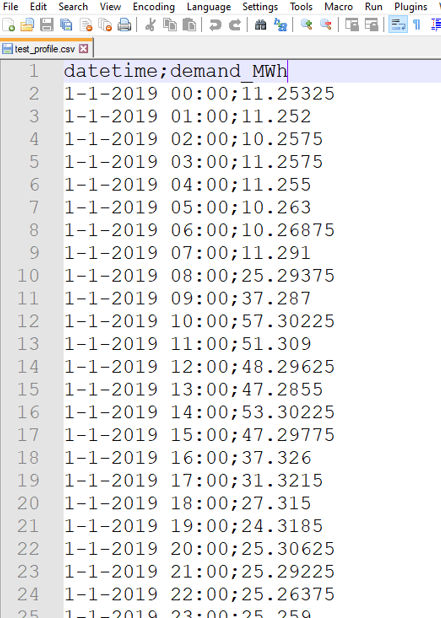
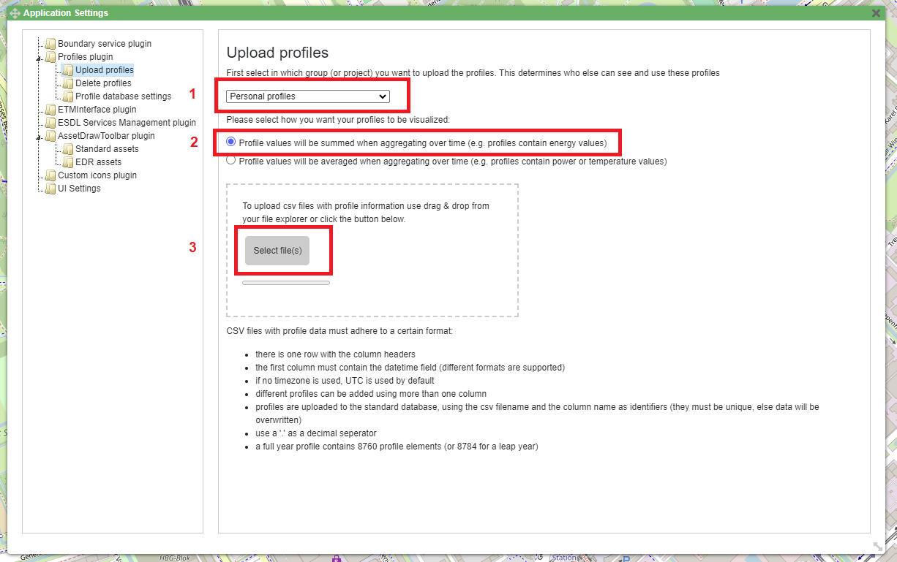
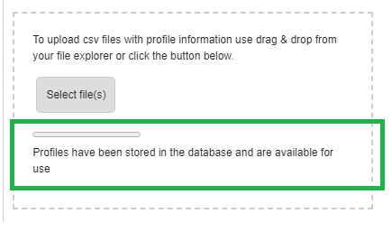
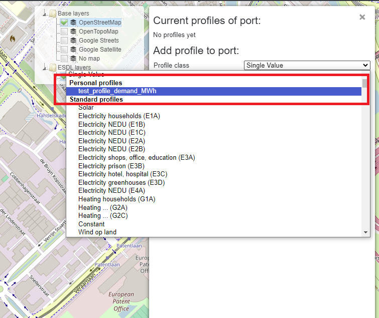
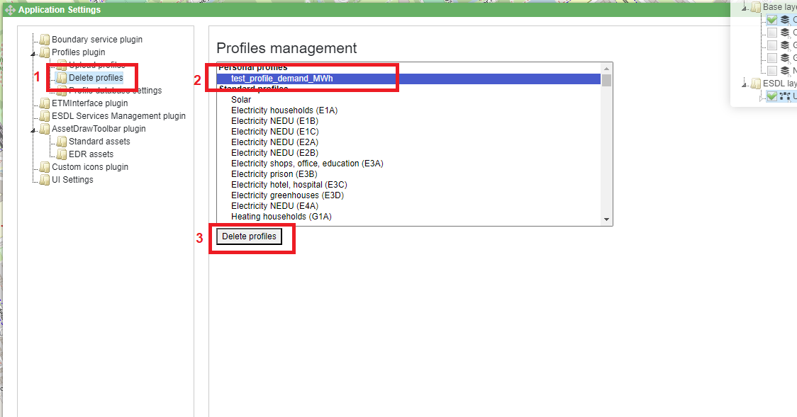

Profile manager
===============

In MapEditor, different profiles can be added to energy assets' In and OutPorts. A user can choose a profile from the list of pre-defined EDR or MapEditor's DB profiles (such as standard NEDU profiles), but also define and choose their own profiles. Adding custom profiles, as well as deleting them, is done through the *Profile manager*.

Profiles plugin
---------------

To access the *Profile manager*, click on *View* menu item on the menu bar (nr.1), and go to *Settings* (nr.2).

Profiles plugin allows a user to manually create and add a profile. To access this feature, click on *Profiles plugin* (nr.1) and fill in the fields on the window (nr.2). Using these fields, a profile can be created using data from different InfluxDBs.

Furthermore, by selecting a profile from the dropdown menu (nr.1), a user can visualize existing (uploaded) profiles, and check their parameters such as database name, measurement, start and end date, and others.

Uploading custom profiles
-------------------------

To upload custom profile, first go to the *Profile manager* as shown above. Then, navigate to *Profiles plugin* and click on *Upload profiles* (nr.1). For it to be recognized by MapEditor, a custom profile should be provided as a CSV file that adheres to a certain format. The formatting rules are listed at the bottom of the window (see the green box).
Profiles can be stored in different groups, depending on the access rights. For example, a user can define a personal profile (accessible only by the user that defined it), a profile related to a certain project (accessible by users working on the same project), or a profile that will be stored to EDR or MapEditor's database (accessible by everyone).
To upload a custom profile, choose the appropriate access group from the dropdown menu (nr.2).

An example CSV file used to create a custom profile is shown below.

In this example, a custom profile will be added to the *Personal profiles* group (nr.1). Select whether the profile values should be averaged or summed over time (depending on the unit the values represent) (nr.2), and click on *Select files* (nr.3) to select the desired files to be uploaded.

If a profile is successfully uploaded, a message is displayed on the window.

Once a profile is uploaded, it can be added to an asset's port by selecting it from the *Profile class* dropdown menu.

Deleting profiles
-----------------

To delete an uploaded file, navigate again to *Profiles plugin* by clicking on *View* menu item on the menu bar (nr.1), and going to *Settings* (nr.2).

Select *Delete profiles* (nr.1), scroll down to the profile created above (nr.2), and click on *Delete profiles* (nr.3).

