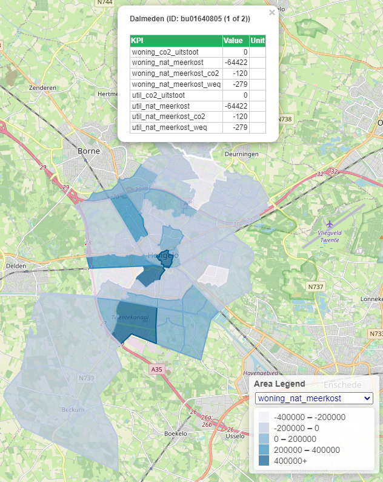

Visualizing KPIs
================

KPIs in ESDL can be attached to different objects:

- the top level area
- sub areas
- assets

Top level area KPIs
-------------------
KPIs attached to the top level area are visualized using a dialog with graphs.

Sub area KPIs
-------------
KPIs attached to areas that are sub areas of the top level area are visualized as follows:

- In the legend at the bottom right you can choose the KPI that is used for coloring the areas
- If you hover over the areas, all KPIs attached to that area are shown as a table in the tooltip

Asset KPIs
----------
Asset KPIs are currently not visualized