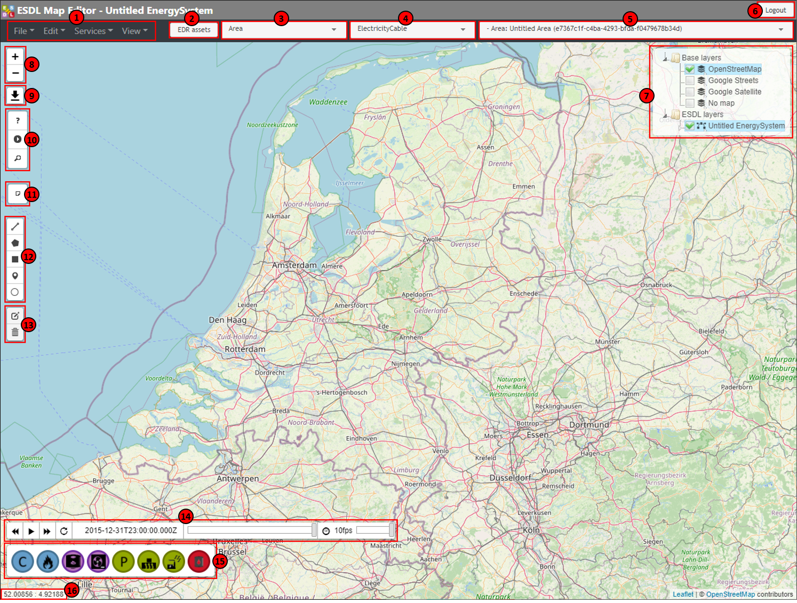

The ESDL MapEditor user interface
=================================

Once you log in into the ESDL MapEditor, you will see a user interface as shown in the following picture:

The different components will be explained in the table below

====== ====================================================================
Number Description
====== ====================================================================
1      Top level menus
2      Button to get information stored in the Energy Data Repository (EDR)
3      Asset draw select tool
4      Line draw select tool
5      Area select; determines to which ESDL area assets are being added
6      Logout button
7      ESDL layer control
8      Zoom buttons
9      Create screenshot of current view
10     ESSIM simulation controls
11     Place notes on the map
12     Draw assets
13     Edit and remove assets
14     Animation toolbar
15     Asset draw toolbar
16     Shows the coordinates (lat/lon) of the mouse pointer on the map
====== ====================================================================

