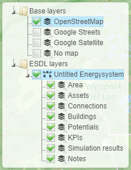

The ESDL MapEditor user interface
=================================

Once you log in into the ESDL MapEditor, you will see a user interface as shown in the following picture:

.. image:: images/mapeditor_userinterface_numbered_components.png
  :width: 800
  :alt: ESDL Building Editor user interface

The different components will be explained in the table below

====== ====================================================================
Number Description
====== ====================================================================
1      Top level menus
2      Button to get information stored in the Energy Data Repository (EDR)
3      Asset draw select tool
4      Line draw select tool
5      Area select; determines to which ESDL area assets are being added
6      Logout button
7      Layer control
8      Zoom buttons
9      Create screenshot of current view
10     ESSIM simulation controls
11     Place notes on the map
12     Draw assets
13     Edit and remove assets
14     Animation toolbar
15     Asset draw toolbar
16     Shows the coordinates (lat/lon) of the mouse pointer on the map
====== ====================================================================

Top level menus (1)
-------------------

File menu
^^^^^^^^^

.. csv-table::
    :header: "Menu item", "Description"

    "New ESDL", "Start with a new empty energy system. Remove all current ESDL files loaded."
    "Load ESDL", "Load an ESDL file from your local file system. Remove all current ESDL files loaded."
    "Import ESDL", "Import an ESDL file from your local file system. This ESDL will be added to the list of loaded ESDLs in the layer control section (7)."
    "Save ESDL", "Save the currently selected ESDL to your local file system."
    "Load from ESDL drive", "Load or import an ESDL file from the ESDL drive (ESDL cloud storage)."
    "Save to ESDL drive", "Save an ESDL to the ESDL drive."

Only for Mondaine project partners (the Mondaine Hub was the predecessor of the ESDL drive):

.. csv-table::
    :header: "Menu item", "Description"

    "Load ESDL from Mondaine Hub", "Load or import an ESDL file from the Mondaine Hub"
    "Save ESDL to Mondaine Hub", "Save an ESDL file to the Mondaine Hub"

Edit menu
^^^^^^^^^

.. csv-table::
    :header: "Menu item", "Description"

    "ESDL browser", ""
    "Energy carriers", ""
    "Sectors", ""
    "Shapefile converter", ""

Services menu
^^^^^^^^^^^^^

.. csv-table::
    :header: "Menu item", "Description"

    "Energy system statistics", ""
    "External ESDL services", ""
    "Get boundary information", ""
    "ESSIM simulation", ""
    "Load animation", ""
    "ESDL compare", ""
    "ESDL merge", ""

View menu
^^^^^^^^^

.. csv-table::
    :header: "Menu item", "Description"

    "WMS layers", "Allows to visualize WMS layers in the MapEditor"
    "Show/hide animation toolbar", "Show or hide the animation toolbar - for controlling the load animation"
    "Show/hide asset draw toolbar", "Show or hide the asset draw toolbar - for quickly adding certain assets"
    "Show/hide KPIs", "Show or hide KPI window"
    "Settings", "Settings for the MapEditor and its plugins"

Layer control (7)
-----------------

The layer control is split into two sections:
* Base layers
* ESDL layers

The base layers section allows you to choose the backgorund of the map, either openstreetmap (the default), google or
no map. The latter one can be used for schematic diagrams where the physical location is not important.

In the ESDL layer section you will find one item for each ESDL loaded in the MapEditor. The ESDL information is separated
in different layers that can each be shown or hidden. See the table below for a detailed description of the different
ESDL sub layers.

================== =========================================================
Layer              Description
================== =========================================================
Area               Layer showing the area boundaries
Assets             Layer showing all ESDL assets
Connections        Layer showing logical connections between assets
Buildings          Layer showing building geometries
Potentials         Layer showing energy potential information
KPIs               Layer showing KPIs
Simulation results Layer showing simulation results, like animation of loads
Notes              Layer showing the notes
================== =========================================================
