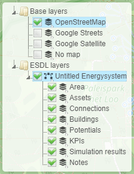

Layer control
=============

The layer control is split into two sections:

* Base layers
* ESDL layers

The base layers section allows you to choose the backgorund of the map, either openstreetmap (the default), google or
no map. The latter one can be used for schematic diagrams where the physical location is not important.

In the ESDL layer section you will find one item for each ESDL loaded in the MapEditor. The ESDL information is separated
in different layers that can each be shown or hidden. See the table below for a detailed description of the different
ESDL sub layers.

================== =========================================================
Layer              Description
================== =========================================================
Area               Layer showing the area boundaries
Assets             Layer showing all ESDL assets
Connections        Layer showing logical connections between assets
Buildings          Layer showing building geometries
Potentials         Layer showing energy potential information
KPIs               Layer showing KPIs
Simulation results Layer showing simulation results, like animation of loads
Notes              Layer showing the notes
================== =========================================================
